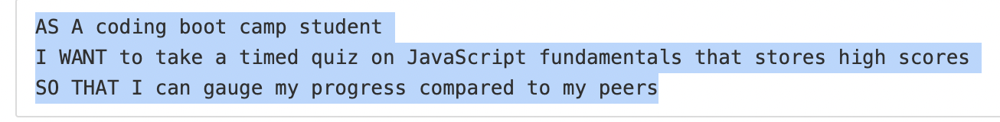

# code-quiz
# Shane O'Connell
## 12-15-2020

## User Story 

## Acceptance Criteria

### Example Code Quiz

## Pseudocoding

Home Page : 

    * Centered headline with paragraph outline quiz rules. 

    * Start button that begins quiz

    * Timer set to 0 at home page, activated by start button. 

Quiz Page : 

    * Once start button is clicked, timer set to 75 and begins counting down. 

    * There should be at least 4 functions for this to work properly:

        1. Start Game function

        2. Gameplay Function: Track timer, score, and 
            --Bulk of code will be w/n this function.
        3. End game and __STORE__(localStorage) info

        4. Reset Function

    * EventListeners

        1. Start button 

        2. Input User Info Box

        3. - 6. Each answer on each question should respond to a click

        7. Reset to beginning button. 

# Summary

Okay. So I didn't finish.  But damn I gave it my all.  

I spent north of 12 hours going through material both directly and indirectly related to the assignment. I worked with the BCS Learning Assistants, my instructor, and my classmates and I'm reasonably content with the results.  It irks me now and will irk me well past the end of class that I didn't finish but I tried my best and, really, that's all I can ask of myself. I learned A LOT during this assignment.   

I was able to get the front page and start button working.  The answers on the first question load the intended correct/incorrect value when the user selects their response. The timer begins upon clicking of the start button and stops when it reaches zero.

However, the rest of the quiz does not respond to the user's clicks.  I wish I had a reliable answer to my problem but I think my research skills have improved as a result of this work and I think that is really the crux of these assignments. 

